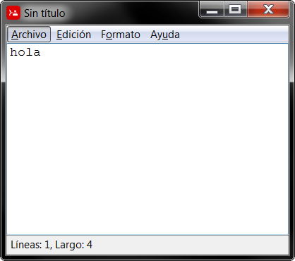

# Notepad Red
Text editor made in Red language.

## Overview
* Reading and writing files
* Line and chars count (status bar)
* Font selection

## How run this?

1. Download the project and navigate to its folder

2. Open a terminal and run the following command

    if you are using a integrated client bash. (GitBash, ConEmu, Cmder, etc.)
    ```
    interpreter/red.exe --cli src/notepad-red.red
    ```

    or if you use of Windows (cmd)
    ```
    interpreter\red.exe --cli src\notepad-red.red
    ```


## Screenshots
<p align="center">
    
</p>

## References
* [red-lang.org (official website)](https://www.red-lang.org/p/documentation.html)
* [VID (Visual Interfacr Dialect) in Red](https://www.red-by-example.org/vid.html)
* [VID Red | dialogs](https://www.red-by-example.org/vid.html#15)
* [VID Red | events](https://www.red-by-example.org/#cat-e04)
* [helpin.red](https://helpin.red/Introduction.html)
* [red-by-example.org](https://www.red-by-example.org/)
* [red-language-documentation.readthedocs.com](https://red-language-documentation.readthedocs.io/en/latest/Coding-Style-Guide/)
* [redprogramming.com](https://redprogramming.com/Getting%20Started.html)
* [chenyitian.gitbooks.io (various tutorials)](https://chenyitian.gitbooks.io/getting-started-with-red/content/docs/fundamentals.html#37-loops)
* [redlanguage.blogspot](https://redlanguageblog.blogspot.com/)
* [red.github.io](https://red.github.io/)
* [red personal user blog](https://jennyk36.blogspot.com/)

## Author's note

Except for the mentioned links, there is not much information about the 
network language, nor can you find many examples on the Internet, and 
the few communities or forums that are found seem to be strangely 
abandoned or with little participation. I hope this example is useful 
for anyone who wants to venture into this strange and powerful language.


<!-- sofware made in Argentina -->