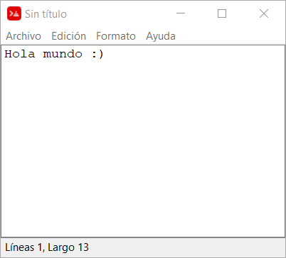

# Notepad Red
Simple text editor written in the Red programming language (similar 
to the REBOL language)

## Features
* Read and write .txt files
* Line and characters counter (status bar)
* Font selection

## Usage (steps)
1. Download this repository
2. Locate yourself within the repository folder (`notepad-red` folder)
3. Open a Windows terminal and run the following command
    ```
    interpreter/red.exe src/notepad-red.red
    ```
    Or optionally in client mode (without opening the Red interpreter)

    ```
    interpreter/red --cli src/notepad-red.red
    ```
    and finally press `Enter`. A window will then open with the script running


## Screenshots
<p align="center">
    
</p>

## References
* [red-lang.org (official website)](https://www.red-lang.org/p/documentation.html)
* [VID (Visual Interfacr Dialect) in Red](https://www.red-by-example.org/vid.html)
* [VID Red | dialogs](https://www.red-by-example.org/vid.html#15)
* [VID Red | events](https://www.red-by-example.org/#cat-e04)
* [helpin.red](https://helpin.red/Introduction.html)
* [red-by-example.org](https://www.red-by-example.org/)
* [red-language-documentation.readthedocs.com](https://red-language-documentation.readthedocs.io/en/latest/Coding-Style-Guide/)
* [redprogramming.com](https://redprogramming.com/Getting%20Started.html)
* [chenyitian.gitbooks.io (various tutorials)](https://chenyitian.gitbooks.io/getting-started-with-red/content/docs/fundamentals.html#37-loops)
* [examples](https://wesleyhill.co.uk/p/writing-gui-apps-using-the-red-programming-language/)
* [development](https://static.red-lang.org/red-system-specs.html)

## Author's note

Aside from the links mentioned, there isn't much information available 
about the network language, nor are there many examples online, and the 
few communities or forums that exist seem strangely abandoned or have 
little participation. I hope this example will be useful for anyone who 
wants to delve into this unique and powerful programming language.


<!-- sofware made in Argentina -->
